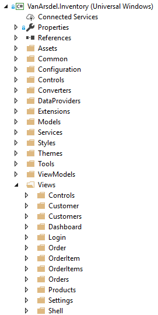
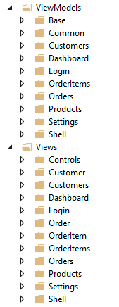
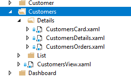

# Solution Structure

The VanArsdel Inventory application consists of 2 projects
1. VanArsdel.Inventory
2. VanArsdel.Data

## VanArsdel.Inventory
The first project is the application isself. It's a Universal Windows Application (to be run inside the Universal Windows Platform). It's the one that will be our startup project. In order to run it, we have to deploy it using either the x86 or the x64 platform configurations.

This is a snapshot of the structure of the solution:



Please, notice that we'are using a mixed approach to organize the folders in the projects.

- The root folders are organized following the tech-folders paradigm.
Folders like, *Common*, *Configuration*, *Controls*, *Converts*...  
- Second and subsequent levels follow a feature-folder approach. Examples are the Views and ViewModels folders.

Inside them, we have folders with names that denote the feature they're related to. You can see it in the following snapshot.



Both *Views* and *ViewModels* are almost a mirror, with little differences. 

Now, let's analyze the contents of each folder:

### Assets
It's a default folder that contains the non-programmatical resources of the application. A well-known example is images (bitmaps). There you can find the logos and images like the ones the application will use for the Microsoft Store, or the Splash Screen, will all of their different sizes.

### Common
We're using the folder to keep common abstractions like the *RelayCommand* or the *ValidationConstraint*. These classes aren't directly related to our domain and could be used in other projects, so the name "common"

### Configuration

We're storing here the configuration of the application. It's the natural folder to keep the *AppSettings* class, where we are placing constants and providing a way to communicate with the built-in `ApplicationData.Current.LocalSettings`, the mechanism that UWP provides to load/store user-specific configuration.

In this folder we can also find classes that determine the configuration (the behavior) of all the application, like the ServiceLocator and the Startup classes. They are part of the configuration because switching some implementations inside them, we can easily extend our app, since where are using Dependency Injection. Let's say that the configuration is the part of the application that we expect to change or would like to be able to change that is not part of the design.

### Controls

In this folder we will find custom controls, abstractions that are directly related with the User Interface. *IconButtons*, *IconLabels*, *Search* controls.

It's the place to put anything that inherits from the *Control* class, like *UserControls*.

### Converters

It's the folder that contains all the converters in the solution. Converters are specific classes to convert between 2 types of data. This folder is quite common to find in UWP applications.

You may already know converters from other technologies like *WPF* or *Silverlight*. 

The are used mainly in the XAML definition of the views, as resources. They implement the `IValueConverter` interface and consist of 2 methods, one for converting from type A to to B, and another for converting back B to A.

For instance:

```csharp
public sealed class BoolNegationConverter : IValueConverter
{
    public object Convert(object value, Type targetType, object parameter, string language)
    {
        return !(value is bool && (bool)value);
    }

    public object ConvertBack(object value, Type targetType, object parameter, string language)
    {
        return !(value is bool && (bool)value);
    }
}
```

This converter Converts a boolean to a negated boolean. That's way both methods are the same.

Another sample is this converter that converts a DateTimeOffset to a formatted string.

```csharp
public sealed class DateTimeFormatConverter : IValueConverter
{
    public object Convert(object value, Type targetType, object parameter, string language)
    {
        if (value is DateTimeOffset dateTime)
        {
            string format = parameter as String ?? "shortdate";
            var userLanguages = GlobalizationPreferences.Languages;
            var dateFormatter = new DateTimeFormatter(format, userLanguages);
            return dateFormatter.Format(dateTime);
        }
        return "N/A";
    }

    public object ConvertBack(object value, Type targetType, object parameter, string language)
    {
        throw new NotSupportedException();
    }
}
```

Please, notice that conversion is only applicable in one direction. That's why the ConvertBack method is intentionally raising an exception when called. 

### DataProviders

This folder contains the different Data Providers from which the application can load/store its data. It also contains the interfaces and a static factory that selects the Data Provider to be used depending on the configuration.

Currently, there are these providers available:
- **SQLite Provider.** Manages data using SQLite.
- **SQL Server Provider.** Manages Data using SQL Server.

### Extensions

Extensions is a well-known folder for C# projects. It contains holder clases with **extensions methods**.

### Models

It contains entities that are designated to be bound to components of the user interface. In order words, they are the View Model counterpart of the data classes in the VanArsdel.Data project.

The main characteristic of these classes is that they implement the `INotifyPropertyChanged` interface to notify changes in their properties. This is essential for Bindings to work. Each time a change is produced in a model classes, we raise a nofication so the user interface is updated according to the changes. 

As you will see, Model classes derive from ModelBase, the class that encapsulates the implementation of `INotifyPropertyChanged`.

### Services

The Services folder contains all the application services that aren't directly related to the data access. Inside you will find facilities like the Navigation Service, the Log Service, the Dialog Service and others. 

Notice that most of the are related to the user interface. This happens very often: Specially when we use MVVM, we have to build services. Their goal is to decouple the UI from the underlying model, using View Models. Those View Models will be the ones that, in the end, will have to deal with view specific features, like Dialogs or Navigation.

For isntance, a View Model will know nothing about how the navigation is handled in the Universal Windows Platform. It will only know that there is a service, Navigation Service, that exposes methods to navigate to other View Models. This is essential how we have to think when have to interact with the UI specific features. Just follow rule #1 in MVVM: Don't add references to anything coming from the UI into your View Models.

For more information about the MVVM pattern, go to [the dedicated section](../mvvm).

### Styles

This is a well-known feature folder for Universal Applications. It contains Styles defined in XAML that are applied in the controls, at UI level. The Styles are grouped inside Resource Dictionaries. There you will find .xaml files named after the control they targeted. For example, Buttons.xaml contains the Resource Dictionary having all the Styles applied to `Buttons`

### Themes 

It's similar to the previous one. It also contains Styles. This folder is somewhat special because it contains the Generic.xaml, a Resource Dictionary that sometimes acts as a the master Resource Dictionary of the application.

Generic.xaml is basically another Resource Dictionary. We can use composition with them, so we can make a Resource Dictionary composed by several others using a syntax like this in the XAML

```

    <ResourceDictionary.MergedDictionaries>
        <ResourceDictionary Source="ms-appx:///Themes/Controls/Buttons.xaml" />
        <ResourceDictionary Source="ms-appx:///Themes/Controls/Inputs.xaml" />
        <ResourceDictionary Source="ms-appx:///Themes/Controls/Section.xaml" />
    </ResourceDictionary.MergedDictionaries>
```

Every dictionary that is inside MergedDictionaries will be part of the root dictionary.

If you want to know more about Resource Dictionaries and Resources in general, please, check more about the topic [here](https://docs.microsoft.com/en-us/windows/uwp/design/controls-and-patterns/resourcedictionary-and-xaml-resource-references)

### Tools

Here you will find utility classes that are providing core funtionality for the UI that don't adhere to any of the existing folders and aren't related to any specific feature.

### ViewModels

The ViewModels folder is the folder that will contain all the View Models of the application. It's a feature folder, that means that it will contain a folder per main feature, like *Dashboard*, *Login*, *Orders* and so on. Normally, each class will target a specific view, so if we have a View called CustomersView, we will have an associated View Model called CustomersViewModel. Classes in the Models folder are also View Models, like the ones in this folder, but in this folder you will find the ones that are View-oriented. Models are entity-oriented View Models.

The classes here also implement `INotifyPropertyChanged` to communicate with the views and there is also a View Model base (`ModelBase`)

### Views

This folder is the one that stores all the definions of the Views. These definitions are commonly written in XAML. Views are usually `Pages`, but here you can find more granular components, like UserControls. 

We are using composition to define our Views, and we decided to place the components of each view (UserControls) close to the view that contains them. For example: The CustomersView has 2 differentiated parts: The List and the Details. At the same time, the Details part is composed by the Card, the Details itself and the Orders part. This is represented as a folder/component hierarchy. You can appreciate it in the image below.

