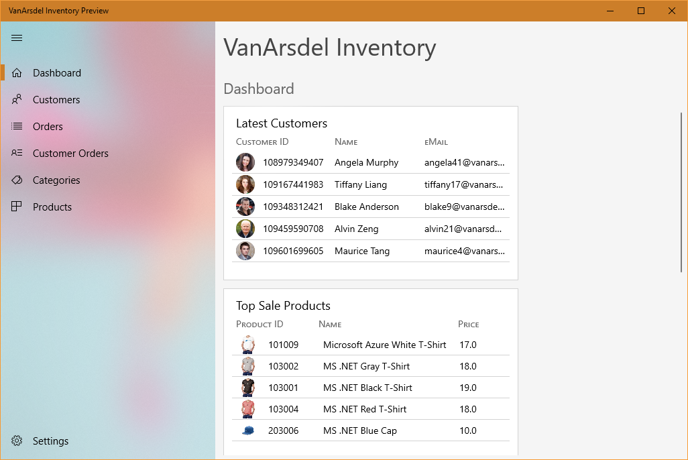

## Using Fluent Design
### Brushes
If you are familiarized with UWP, you may already know what [Brushes](https://docs.microsoft.com/en-us/windows/uwp/design/style/brushes) are. In short, Brushes are the paint that a Control or any other Visual Element uses to paint itself. For example, setting the Background of a Button to a blue Solid Color Brush, will result in a Button with a blue background. 

There many kinds of Brushes, like 
 - [SolidColorBrush](https://msdn.microsoft.com/library/windows/apps/BR242962): Paints the surface with a solid color
 - [LinearGradientBrush](https://msdn.microsoft.com/library/windows/apps/BR210108): Paints the surface with a linear gradient
 - [ImageBrush](https://msdn.microsoft.com/library/windows/apps/BR210101): Paints the surface with an image
 -	…
#### Meet the new Acrylic Brushes
One of the basic and most apparent steps to make an application align with the Fluent Design is the usage of the new **Acrylic brushes**

An Acrylic brush is (another) special kind of brush that you can use to improve the look and feel of your applications. 
#### What makes Acrylic Brushes so special?
While other brushes paint with a color or with using an image, Acrylic Brushes don’t paint on the surface, but they apply a very appealing translucency effect that makes the surface look like a blurry glass. This allows elements of your user interface blend nicely with the rest of the Windows environment, like other windows or elements of the system.

#### Why should we use them?
From a pure design point of view, acrylic brushes help users interact with your application, because **different parts of the layout will look different**, thanks to the material effect (glassy) effects that Acrylic provides. For example, a Master-Detail view will ideally have the Master part painted with an acrylic background, whereas the main content will have a solid color background. This allows the user to easily focus on the content.

The whole reason to use the acrylic brushes is not just because the interface elements look nicer, but most importantly, because different degress of this effect can set a visual hierachy in your interface.


#### Using Acrylic Brushes
There is a whole set of Acrylic Brushes to apply. Fluent Design suggests you to use each of them for specific parts of the user interface.

For example, it's very common to have a navigation **side panel** in your application that allows the user to navigate to other views and sections. This side panel is the perfect candidate to have a translucent effect, like in the aforementioned Master-Detail scenario. Since the user will focus in the content part where the most of interactions will take place, the side panel would benefit the usability of your application when you use the acrylic effect.

Let's see a sample:


XAML:

```xml
<Grid Background="{ThemeResource ApplicationPageBackgroundThemeBrush}">
        
    <Grid.ColumnDefinitions>
        <ColumnDefinition Width="4*"/>
        <ColumnDefinition Width="9*"/>
    </Grid.ColumnDefinitions>

    <Grid Background="{ThemeResource SystemControlChromeHighAcrylicWindowMediumBrush}">
        <TextBlock>SIDE PANEL</TextBlock>
    </Grid>
    <Grid Grid.Column="1">
        <TextBlock>MAIN CONTENT</TextBlock>
    </Grid>

</Grid>
```

Notice the markup with that sets the Background of the first nested Grid: 

`Background="{ThemeResource SystemControlChromeHighAcrylicWindowMediumBrush}"`

As you can see, we are using a special Theme Resource called `SystemControlChromeHighAcrylicWindowMediumBrush`. This is one of the Acrylic Brushes that you can use for your interface. 

There are many others that are used depending on the situation. You can see a detailed explaination of their usage in [this link](https://docs.microsoft.com/en-us/windows/uwp/design/style/acrylic#acrylic-theme-resources).

#### General guidelines

Basically, you'll use 2 different brushes:
 - `SystemControlChromeHighAcrylicWindowMediumBrush` with a **60%** of tint opacity.
 - `SystemControlAcrylicWindowBrush` with a **80%** of tint opacity.

As a rule of thumb:
 - You should only apply Acrylic Brushes to parts of your application that are somewhat secondary, and **leave the main content with a solid background**. Remember that Acrylic is meant to create a **visual hierarchy**. 
 - In **2-level navigation** (simple master-detail, or one side panel), you should apply `SystemControlChromeHighAcrylicWindowMediumBrush`.
 
 
 - In **3-level navigation**, you should apply 
     - `SystemControlChromeHighAcrylicWindowMediumBrush` to the panel that is further away from the main content.
     - `SystemControlAcrylicWindowBrush` to the panel that is closer to the main content.
     
     
 - For **utility applications** (like Calculator, included in Windows), you can apply an Acrylic Brush to the whole window. You can even apply different acrylic transparency level (the opacity tint), since in this kind of applications, the user will likely spend just a little time in them.
 
#### Other recommendations
 - Use it for panes that are on one side of the application, not for inner elements.
 - Don't apply the same acrylic brush to elements that are place together, because it will produce a "seam" effect.
 - Try to avoid applying acrylic to multiple surfaces, or using multiple opacities. Fluent Design-based application will rarely use more than 2 different panes with this effect.

#### NavigationView and Fluent Design

Starting with Windows 10 Fall Creators Update, there is a new control called [NavigationView](https://docs.microsoft.com/en-us/uwp/api/windows.ui.xaml.controls.navigationview). Apart from being useful to easily implement navigation in our app, it's very convenient because it will use Acrylic Brushes (among other Fluent Design) automatically. You won't have to apply any brush to your panes or mess with anything in code. It's ready to use. It's definitely a nice addition to this useful control. 

You can see it in action right here



It's located in `ShellView.xaml`
```xml
<NavigationView x:Name="navigationView" MenuItemsSource="{x:Bind ViewModel.Items}" MenuItemTemplate="{StaticResource NavigationViewItem}"
                SelectedItem="{x:Bind ViewModel.SelectedItem, Mode=TwoWay}" SelectionChanged="OnSelectionChanged"
                IsPaneOpen="{x:Bind IsPaneOpen, Mode=TwoWay}" AlwaysShowHeader="False">

    <Grid>
        <Grid.RowDefinitions>
            <RowDefinition Height="*"/>
            <RowDefinition Height="Auto"/>
        </Grid.RowDefinitions>

        <Frame x:Name="frame">
            <Frame.ContentTransitions>
                <TransitionCollection>
                    <NavigationThemeTransition/>
                </TransitionCollection>
            </Frame.ContentTransitions>
        </Frame>
    </Grid>
</NavigationView>
```

Notice that the XAML doesn't specify any look or appearance style in it. It just applies the Acrylic surface automatically to the sidebar when needed. 

Also, a very handy feature of that NavigationView hels you handle the different states of the layout according to available size, so it can adapt ifself to different form-factors and allowing a satisfactory user experience in each of them. This is also called "UI responsiveness".